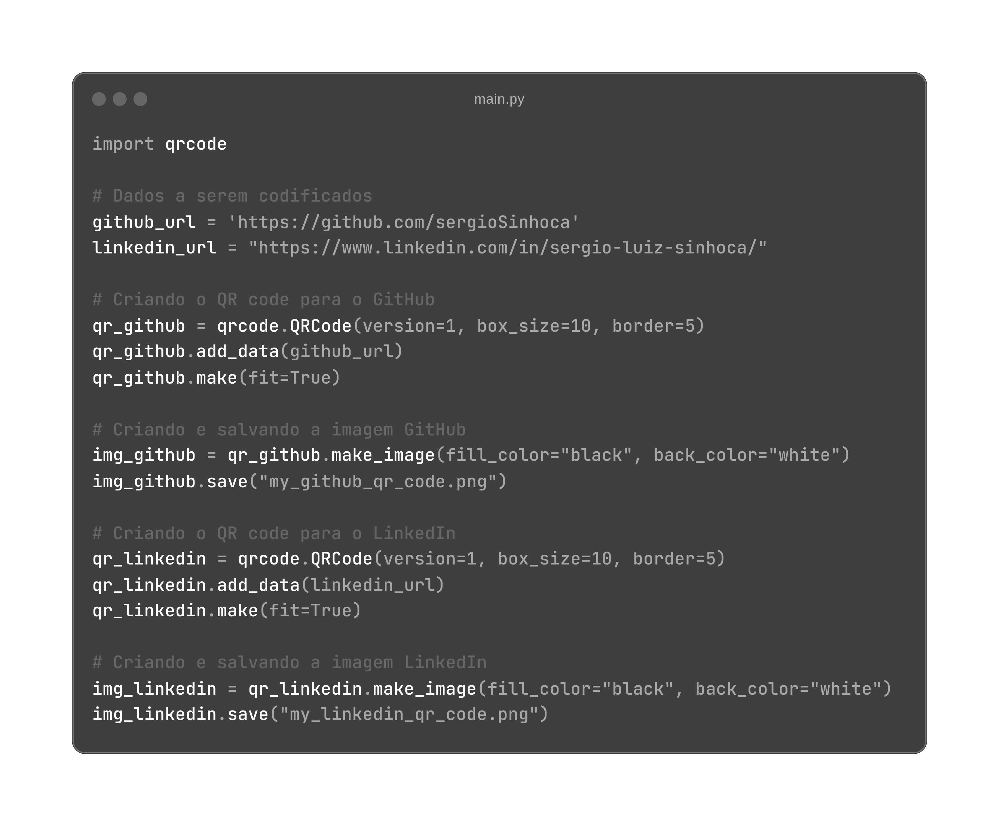
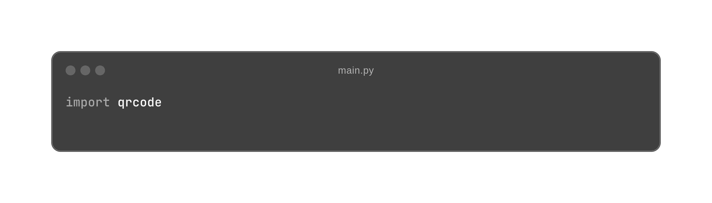
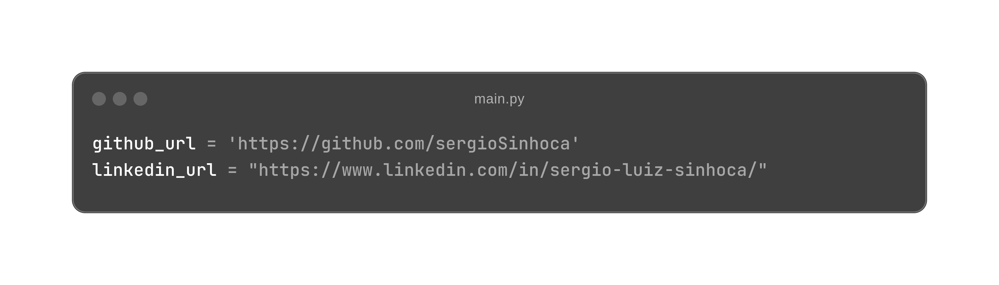
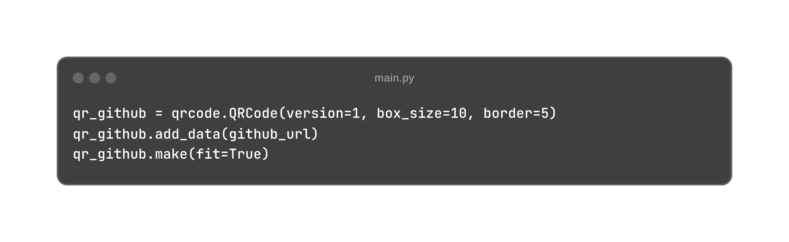
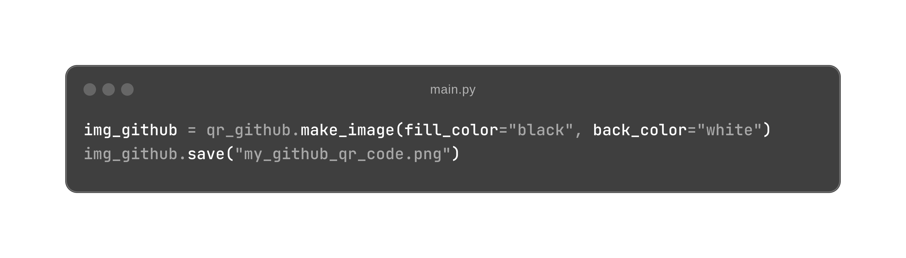
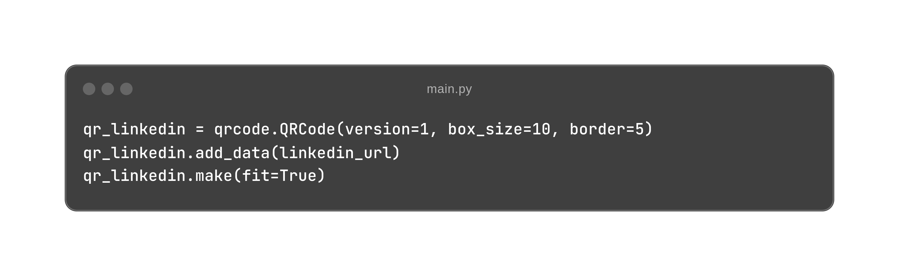
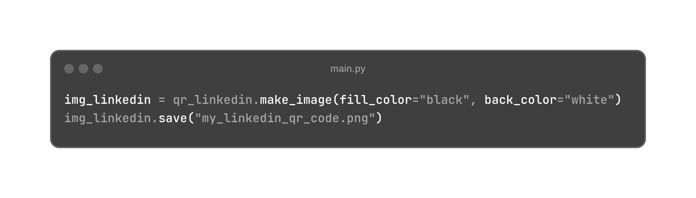

# QR Code Generator

Este projeto demonstra como gerar QR Codes em Python utilizando a biblioteca `qrcode`. 
Neste exemplo, foi gerado QR Codes para o links do GitHub e Linkedin.

## Requisitos

- Python 3.x
- Biblioteca `qrcode`
- Biblioteca `Pillow` (para manipulação de imagens)

## Instalação

Primeiro, instale as bibliotecas necessárias:

```bash
pip install qrcode[pil]
```
## Uso

O código a seguir cria QR Codes para URLs específicas do GitHub e LinkedIn e salva as imagens resultantes em arquivos PNG.

<p align="center">

</p>

## Explicação do Código

### 1. Importação da Biblioteca:
Importa a biblioteca `qrcode` que é utilizada para gerar QR Codes. 
<p align="center">

</p>

### 2. Dados a serem codificados:
Define as URLs que serão codificadas nos QR Codes.
<p align="center">

</p>

### 3. Criação do QR Code para o GitHub:
<p align="center">

</p>

- `version=1`: Define a versão do QR Code. Versões maiores podem armazenar mais dados.

- `box_size=10`: Define o tamanho de cada "caixa" no QR Code.

- `border=5`: Define a espessura da borda ao redor do QR Code.

- `add_data(github_url)`: Adiciona os dados a serem codificados.

- `make(fit=True)`: Ajusta o QR Code ao tamanho dos dados.

### 4. Criação e Salvamento da Imagem GitHub: 
<p align="center">

</p>

- `make_image(fill_color="black", back_color="white")`: Cria a imagem do QR Code com cores específicas.

- `save("my_github_qr_code.png")`: Salva a imagem do QR Code em um arquivo PNG.

### 5. Criação do QR Code para o LinkedIn:
O processo é o mesmo que para o GitHub, mas com a URL do LinkedIn.
<p align="center">

</p>

### 5. Criação e Salvamento da Imagem LinkedIn:
<p align="center">

</p>

## Executando o Código
Para executar o código, salve-o em um arquivo Python, por exemplo, `generate_qr_codes.py`, e execute o arquivo.

Os arquivos `my_github_qr_code.png` e `my_linkedin_qr_code.png` serão gerados no diretório atual.

## Referências
Para mais informações sobre a biblioteca `qrcode`, consulte a [documentação oficial](https://pypi.org/project/qrcode/).
